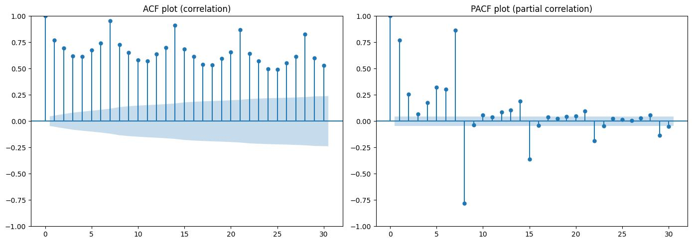
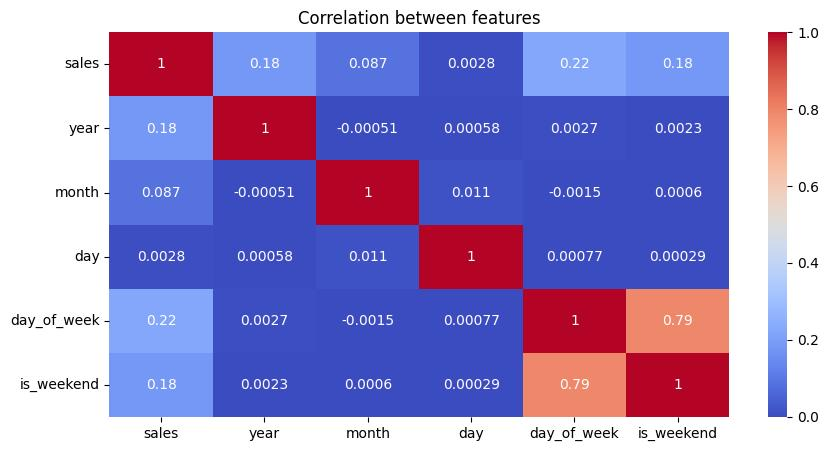
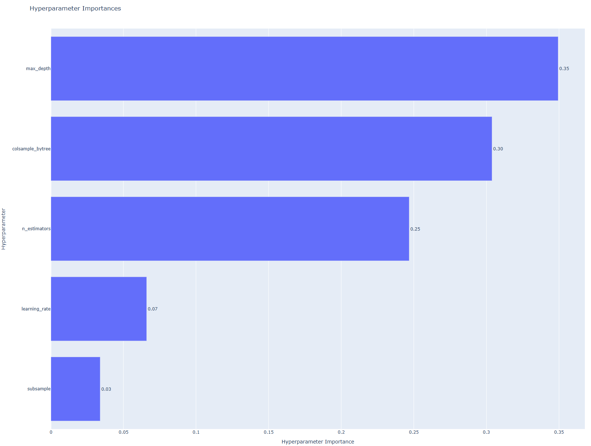
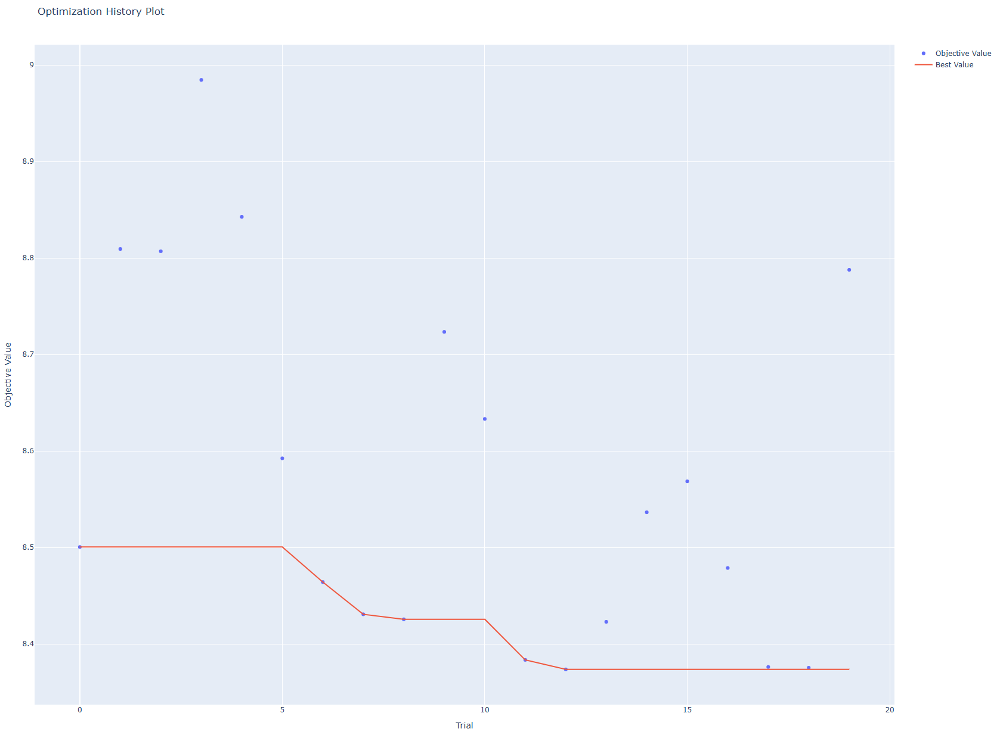
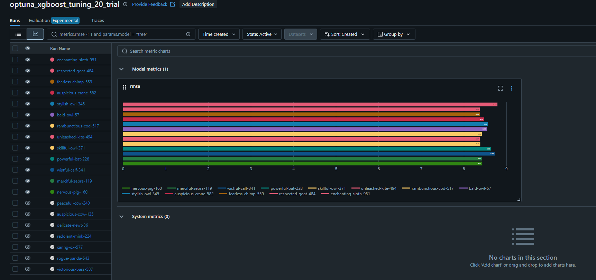

# Sales Demand Forecasting with MLOps
**An End-to-End Machine Learning Project with Feature Engineering, Model Tuning, MLflow Tracking, API Deployment & Monitoring**

- [Project Overview](#project-overview)
- [Dataset](#dataset)
- [Technology Stack](#technology-stack)
- [Feature Engineering](#feature-engineering)
- [Model Training & Baseline](#model-training--baseline)
- [Hyperparameter Tuning with Optuna](#hyperparameter-tuning-with-optuna)
- [Model Tracking with MLflow](#model-tracking-with-mlflow)
- [Model Serving via FastAPI](#model-serving-via-fastapi)
- [Dockerization](#dockerization)
- [Monitoring & Drift Detection](#monitoring--drift-detection)
- [Setup & Run Instructions](#setup--run-instructions)
- [What I Learned](#what-i-learned)

## Project Overview
The goal was not only to make accurate predictions but to cover key MLOps components:
- Data preprocessing & feature engineering
- Model training & evaluation
- Hyperparameter optimization (Optuna)
- Model versioning & tracking (MLflow)
- Serving via REST API (FastAPI)
- Containerization (Docker)
- Offline monitoring & drift detection

## Dataset
This data source contains the daily sales data of 50 items from 10 stores, covering the period from 2013 to 2018. For the dataset go to 
<a href="https://www.kaggle.com/competitions/demand-forecasting-kernels-only/data">Kaggle</a>

<p align="center">
  
  
</p>


## Technology Stack
- Python (Pandas, NumPy, Scikit-learn, XGBoost)
- Optuna (Hyperparameter tuning)
- MLflow (Model tracking)
- FastAPI (Model serving)
- Docker (Containerization)
- Pydantic (Input validation)

## Feature Engineering
[Go to file](src/features/feature_engineering.py)
- Created lag features (1, 7, 14 days) to capture historical demand patterns
- Added rolling averages (7, 14, 30 days) for trend smoothing
- Applied cyclical transformations to temporal features (sin/cos encoding for month and day of week)
- Prevented data leakage by using shift(1) before applying any time-dependent features

## Model Training & Baseline
[Go to file](src/models/train_model.py)
- Built a naive baseline model using the previous day’s sales
- Trained an XGBoost regressor with default parameters
- Evaluated using RMSE, MAE, and R² metrics
- Saved best model version for serving

## Hyperparameter Tuning with Optuna
[Go to file](src/models/tune_model.py)
- Used Optuna for efficient, automated hyperparameter search
- Defined search space for XGBoost (max_depth, learning_rate, subsample, etc.)
- Selected best model using lowest RMSE

Included visualizations:
<p align="center">
  
  
</p>


## Model Tracking with MLflow
[Go to file](src/models/tune_model_mlflow.py)
- Tracked all training runs, metrics, and parameters
- Used MLflow both for basic model training and Optuna runs
- Logged model versions, enabling reproducibility and rollback
  

## Setup & Run Instructions
Install dependencies
```pip install -r requirements.txt```

Preprocess the dataset
```python -m src.data.make_dataset```

Train baseline and XGBoost models
```python -m run_train```

Start API
```uvicorn app.main:app --reload --port 8000```

Run monitoring
```python -m monitor```


## Model Serving via FastAPI
[Go to file](app/main.py)
- Served the trained XGBoost model via RESTful API using FastAPI
- Created a `/predict` endpoint with Pydantic-based input validation
- Supports JSON input → returns prediction
Run locally: ```uvicorn app.main:app --reload --port 8000```

## Dockerization
[Go to file](./Dockerfile)
- Containerized the FastAPI app using a minimal Docker image
- Ensures consistent behavior across environments (local, cloud, etc.)
Command: ```docker build -t sales-api .```
```docker run -p 8000:8000 sales-api```

## Monitoring & Drift Detection
[Go to file](./monitor.py)
- Added a lightweight offline monitoring script (`monitor.py`)
- Loads new data, runs inference, calculates RMSE
- If RMSE exceeds predefined threshold → logs an alert
  
## What I Learned
- How to build a modular, reproducible ML pipeline
- Feature engineering best practices for time series forecasting
- Hyperparameter tuning with Optuna
- Model tracking and comparison with MLflow
- RESTful model serving using FastAPI
- Containerization with Docker
- Monitoring and performance drift detection logic

This project helped me solidify core ML engineering + MLOps skills in practice.
